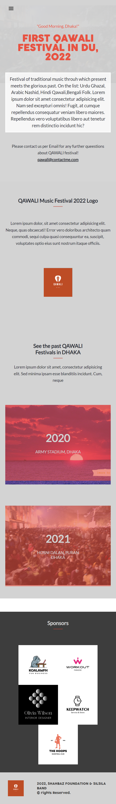

# music event website.

 This is my first capstone project at microverse. The project is about building an music event website regarding Qawali Song Festival, Dhaka University 2022. Here I have write the program using html, css flex-box & javascript html DOM following the design standard provided by microverse. 

## Built With

- html, css, javascript

## Live Demo

[link](https://mdsaib.github.io/capstone1/ )

## Screenshot

### Prerequisites
- knowledge of html, css, javascript DOM
- working knowledge of git and github

### Install
- install git in your local machine.
- install VS code (optional)

## Author

👤 **Author**

- GitHub: [@MdSaib](https://github.com/MdSaib)
- Twitter: [@mdsaib45](https://twitter.com/mdsaib45)
- LinkedIn: [Md Saib](https://linkedin.com/in/mdsaib)

## 🤝 Contributing

Contributions, issues, and feature requests are welcome!

Feel free to check the [issues page](https://github.com/MdSaib/capstone1/issues).

## Show your support

Give a ⭐️ if you like this project!

## Acknowledgments
- The Original design idea by [Cindy Shin in Behance.](https://www.behance.net/adagio07) . Thanks to Cindy Shin.

- Most of the event images are provided by [Al Amin](https://linkedin.com/in/md-al-amin-rakib-a42725195)

- Sponsor logo provided by canva.

## 📝 License

I haven't use any license yet. Near future this project would be come under [MIT] license.
